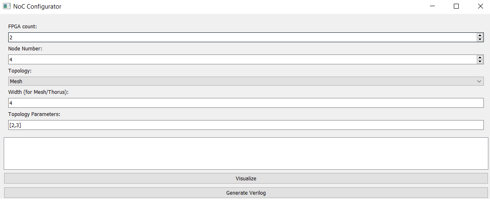
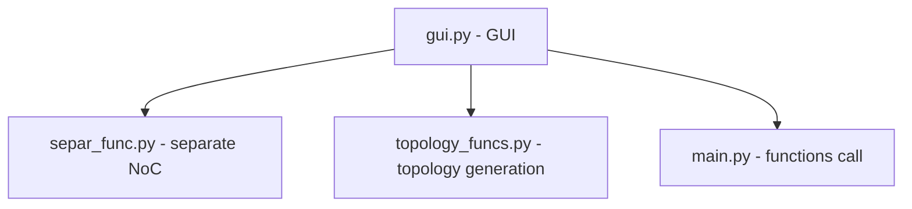

# Project1955

- ***PGNoC***

## Abstract
A promising architecture of modern multicore systems on a chip (SoC) is a network on a chip (NoC). NoC combines processor cores and complex functional blocks into a single switching network. The organization of the architecture according to the network type avoids collisions inherent in the bus architecture. Currently, research and development in the field of NoCs is actively underway.
An important area of work in the field of NoC is the development of hardware prototyping of NoC based on FPGAs. The existing hardware and software complexes are designed for prototyping SoCs and do not take into account the features of NoCs. Therefore, it is required to create a prototype of such a complex. The main objectives of this project are to develop the software parts of a complex for prototyping NoCs on several FPGAs.
The existing software package consists of the "Parser NoC" program and project automation scripts. The "Parser NoC" program generates a description in the Verilog NoC hardware description language with a given topology and routing algorithm, and also creates two top-level files on Verilog that contain disconnected NoC modules along with switches. Project automation scripts are used to automatically generate configuration files for reconfiguring FPGAs.
During the project, it is necessary to improve the software package and add a number of new features to it. The developed software and hardware complex for prototyping NoCs will be used by students of the CAD Department of the MIEM National Research University of Higher School of Economics

## Goal
Development of a software package designed to generate a NoC model and its subsequent implementation on several FPGAs

## Papers

| Work  | Doi | 
|-------|-----|
| Hardware-Software Complex for Network-on-Chip Prototyping Using Multiple FPGAs | 10.1109/access.2026.3652459  | 
| Implementation of Regular Topologies for NoCs Based on schoolMIPS Soft-Processor Cores    | 10.1109/SMARTINDUSTRYCON61328.2024.10515324  | 
| Hardware-Software Complex for Prototyping NoCs Using a Few FPGA Chips  | 10.1109/rusautocon58002.2023.10272798  | 

## Аннотация
Перспективной архитектурой современных многоядерных систем на кристалле (СнК) является сеть на кристалле (СтнК). СтнК объединяет процессорные ядра и сложно-функциональные блоки в единую коммутационную сеть. Организация архитектуры по сетевому типу позволяет избежать коллизий, присущих шинной архитектуре. В настоящее время активно ведутся исследования и разработки в области СтнК.
Важным направлением работ в области СтнК является разработка средств аппаратного прототипирования СтнК на базе ПЛИС. Существующие программно-аппаратные комплексы предназначены для прототипирования СнК и не учитывают особенности СтнК. Поэтому требуется создать прототип такого комплекса. Основными задачами данного проекта является разработка программной частей комплекса для прототипирования СтнК на нескольких ПЛИС.
Существующий программный комплекс состоит из программы «Parser NoC» и сценариев автоматизации проекта. Программа «Parser NoC» генерирует описание на языке описания аппаратуры Verilog СтнК с заданной топологией и алгоритмом маршрутизации, а также создает два файла верхнего уровня на Verilog, которые содержат разъединенные модули СтнК вместе с коммутаторами. Сценарии автоматизации проекта используются для автоматической генерации файлов конфигурации для переконфигурирования ПЛИС.
В ходе проекта необходимо улучшить программный комплекс и добавить в него ряд новых возможностей. Разработанный программно-аппаратный комплекс для прототипирования СтнК будет применяться студентами УЛ САПР МИЭМ НИУ ВШЭ

## Цель
Разработка программного комплекса, предназначенного для генерации модели СтнК и последующей ее имплементации на нескольких ПЛИС

